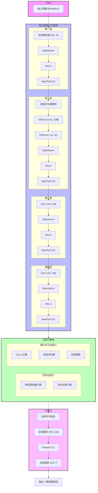
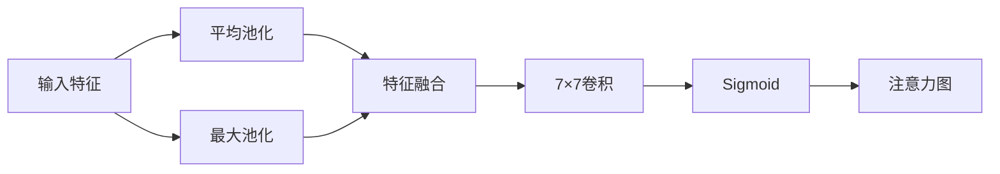
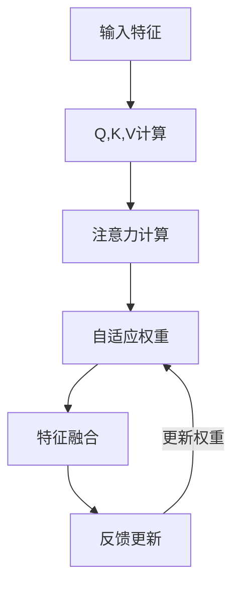
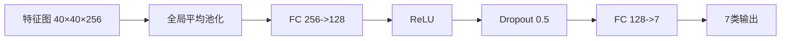
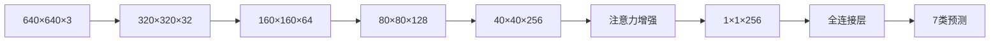
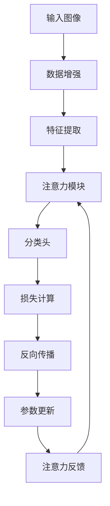

# WindTurbineNet 模型架构

## 整体架构图



## 特征提取主干网络

### 第一层：标准卷积层
- 输入：640×640×3
- 3×3 卷积，32通道
- BatchNorm + ReLU
- MaxPool 2×2 → 320×320×32

### 第二层：深度可分离卷积
- 3×3 深度卷积（32组）
- 1×1 点卷积（64通道）
- BatchNorm + ReLU
- MaxPool 2×2 → 160×160×64

### 第三层：特征提取
- 3×3 卷积，128通道
- BatchNorm + ReLU
- MaxPool 2×2 → 80×80×128

### 第四层：高级特征
- 3×3 卷积，256通道
- BatchNorm + ReLU
- MaxPool 2×2 → 40×40×256

## 注意力模块

### 空间注意力


### 强化学习注意力


## 分类头

### 结构设计


## 数据流

### 特征图尺寸变化


## 训练流程



## 模型特点

1. **轻量级设计**
   - 使用深度可分离卷积减少参数量
   - 采用批归一化加速训练
   - 使用dropout防止过拟合

2. **注意力增强**
   - 集成强化学习注意力机制
   - 动态调整特征权重
   - 提高关键区域的识别能力

3. **多尺度特征**
   - 逐层降采样提取特征
   - 特征图尺寸变化：640->320->160->80->40
   - 感受野逐层增大

4. **故障分类**
   - 7类故障识别：
     - burning（燃烧）
     - crack（裂纹）
     - deformity（变形）
     - dirt（污渍）
     - oil（油污）
     - peeling（剥落）
     - rusty（锈蚀）

## 训练参数

```yaml
train:
  epochs: 100
  batch: 32
  lr0: 0.001
  momentum: 0.9
  weight_decay: 0.0001
  patience: 20
```

## 数据增强

```yaml
augment:
  enabled: true
  hsv_h: 0.015
  hsv_s: 0.7
  hsv_v: 0.4
  flipud: 0.5
  fliplr: 0.5
  rotate: 0.3
  scale: 0.5
  translate: 0.1
  blur: 0.3
  noise: 0.2
``` 